#H2O Web UI
----

- #####Statistical learning is key to many areas: business, technology, health, finance 
- #####Designed to accurately predict quantitative or categorical outcomes for unknown scenarios based on measured data
- #####Supervised learning uses training data to determine a result and improve the accuracy of the model over successive incremental iterations
- #####Unsupervised learning: goal is to describe data organization, not measure outcome 
- #####Some examples of machine learning challenges: 
	- #####Recognizing handwritten text
	- #####Predicting if an email is spam 
	- #####Examining gene expressions
	- #####Assessing the likelihood of a specific disease
	
	


#####This tutorial walks the user through a typical workflow using the H2O web UI. 

### To use the web UI, start H2O:  

	java -Xmx10g -jar h2o.jar
	
####then go to `localhost:54321` in your browser.
---

#Web UI Workflow
---

##1. Import data

###From the Data menu: 

<ul>
<li><H3><a href="http://localhost:54321/2/ImportFiles2.html" target="_blank">Import Files</a> by specifying an absolute path; supports S3, HDFS, NFS, and URLs. Click the file name link to parse the data.</H3></li></ul> 


<H3>or</H3>

<ul><li><H3><a href="http://localhost:54321/Upload2.html" target="_blank">Upload</a> a local file. Make sure to click the Upload button!</H3></li> 
</ul>


---

##2. Parse data

###From the Data menu:

<H3><a href="http://localhost:54321/2/Parse2.html" target="_blank">Parse</a> a data set.</H3> 

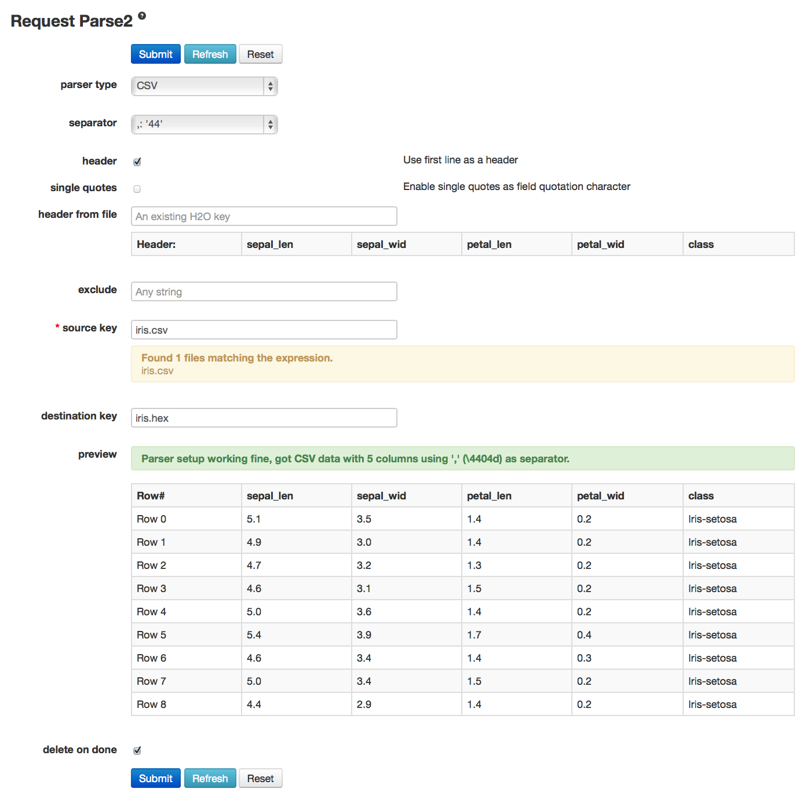

#####**Parser Type**: Specify data format (CSV, XLS, or SVMlight). 

#####**Separator**: Select a separator type.

#####**Header**: Specify if the first line of the data is a header (such as column names and indices). 

#####**Header From File**: Specify the header if it is in a different file. 

#####**Exclude**: Enter a comma-separated list of columns to exclude from parsing. 

#####**Source Key**: (Required) Enter the file key associated with the imported data.

#####**Destination Key**: Specify a name for the parsed data to use as a reference.

#####**Preview**: View an auto-generated preview of parsed data.

#####**Delete on done**:(Recommended) Check this checkbox to delete the imported data after parsing. 

---

##3. Manipulate data

###From the Data menu: 

<H3><a href="http://localhost:54321/2/Inspector.html" target="_blank">Inspect</a></H3> 
####Enter the source key to inspect the data.

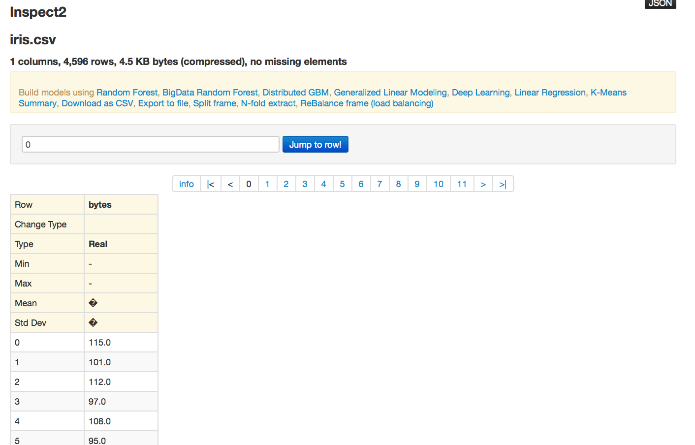

---

<H3><a href="http://localhost:54321/2/SummaryPage2.html" target="_blank">Summary</a></H3> 

####Enter the source key to view variable histograms and statistics.

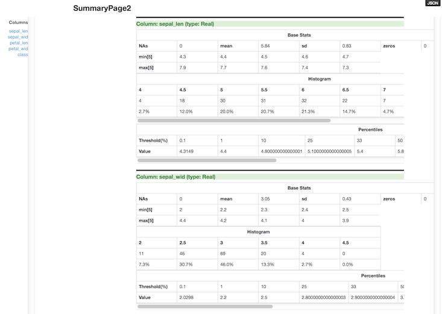

---

<H3><a href="http://localhost:54321/2/QuantilesPage.html" target="_blank">Quantiles</a></H3> 

####Enter the source key and specify a column to view quantiles. 

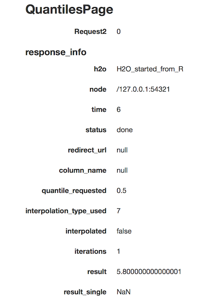

---

<H3><a href="http://localhost:54321/2/Impute.html" target="_blank">Impute</a></H3> 

####Enter the source key, specify a column, and select a method (mean, median, or mode) to replace missing data with substituted values.  

---

<H3><a href="http://localhost:54321/2/Interaction.html" target="_blank">Interaction</a></H3> 

####Enter the source key, the maximum number of factor levels, and the occurrence threshold to create interaction terms between categorical features of an H2O Frame. 


---

<H3><a href="http://localhost:54321/2/CreateFrame.html" target="_blank">Create Frame</a></H3> 

####Enter the source key, the number of rows, and the number of columns to create a frame with the specified dimensions in the specified source. 


---

<H3><a href="http://localhost:54321/2/FrameSplitPage.html" target="_blank">Split Frame</a></H3> 

####Enter the source key and the ratio to use for splitting the data. 

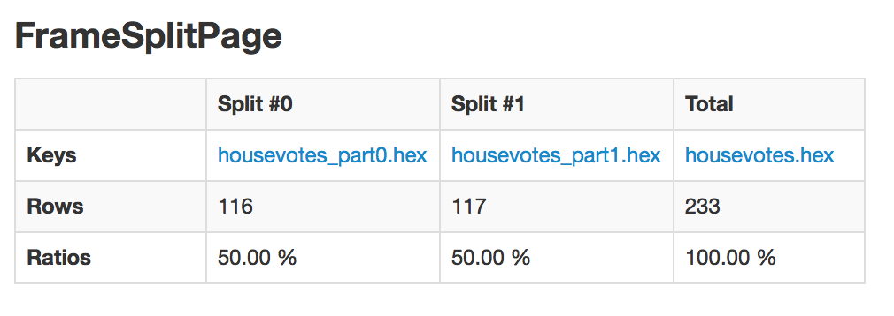

---

<H3><a href="http://localhost:54321/StoreView.html" target="_blank">View All</a></H3> 

####View all data currently in the H2O environment. 

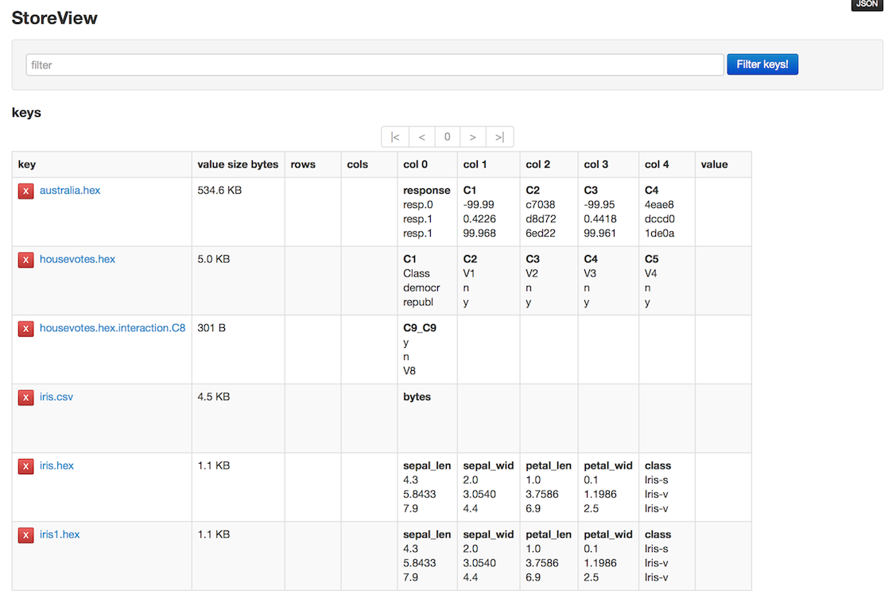

---
 
##Create a model using the Model menu 


<b><a href="http://localhost:54321/2/DeepLearning.html" target="_blank">Deep Learning</a></b> Model high-level abstractions in data by using non-linear transformations in a layer-by-layer method. Deep learning is an example of unsupervised learning and can make use of unlabeled data that other algorithms cannot.


<b><a href="http://localhost:54321/2/GLM2.html" target="_blank">Generalized Linear Model</a></b> A flexible generalization of ordinary linear regression for response variables that have error distribution models other than a normal distribution. GLM unifies various other statistical models, including linear, logistic, Poisson, and more.

<b><a href="http://localhost:54321/2/GBM.html" target="_blank">Gradient Boosting Machine</a></b> A method to produce a prediction model in the form of an ensemble of weak prediction models. It builds the model in a stage-wise fashion and is generalized by allowing an arbitrary differentiable loss function. It is one of the most powerful methods available today.


<b><a href="http://localhost:54321/2/KMeans2.html" target="_blank">K-Means Clustering</a></b> A method to uncover groups or clusters of data points often used for segmentation. It clusters observations into k certain points with the nearest mean.


<b><a href="http://localhost:54321/2/PCA.html" target="_blank">Principal Component Analysis</a></b> Principal Component Analysis makes feature selection easy with a simple to use interface and standard input values.

<b><a href="http://localhost:54321/2/SpeeDRF.html" target="_blank">Random Forest</a></b> Random Forest (RF) is a powerful classification tool. When given a set of data, RF generates a forest of classification trees. Each tree generates a classification for a given set of attributes. The classification from each H2O tree can be thought of as a vote; the most votes determines the classification.

<b><a href="http://localhost:54321/2/DRF.html" target="_blank">Random Forest - Big Data</a></b> Random Forest - Big Data is an alternative to the default SpeeDRF implementation. RF Big Data fully distributes the data, which takes longer to build but also provides better accuracy. 

<b><a href="http://localhost:54321/2/Anomaly.html" target="_blank">Anomaly Detection (Beta)</a></b>Identify the outliers in your data by invoking a powerful pattern recognition model.

<b><a href="http://localhost:54321/2/CoxPH.html" target="_blank">Cox Proportional Hazards (Beta)</a></b> Cox proportional hazards models are the most widely used approach for modeling time to event data. 

<b><a href="http://localhost:54321/2/DeepFeatures.html" target="_blank">Deep Feature Extractor (Beta)</a></b> Extract hidden layer learned features, such as neural networks representation, from a Deep Learning model. 

<b><a href="http://localhost:54321/2/NaiveBayes.html" target="_blank">Naive Bayes Classifier (Beta)</a></b> A probabilistic classifier that assumes the value of a particular feature is unrelated to the presence or absence of any other feature, given the class variable. It is often used in text categorization.

---

##5. Score the model to determine accuracy using the Score menu

<H3><a href="http://localhost:54321/2/Predict.html" target="_blank">Predict</a></H3>
####Enter the model type and the data frame key to predict based on the parsed data. 


---

<H3><a href="http://localhost:54321/2/ConfusionMatrix.html" target="_blank">Confusion Matrix</a></H3>

####Enter the data frame key and select the column with actual results, then enter the data frame key for the predicted data and select the column with the predicted results to display the mean squared error (MSE) rate.  

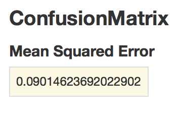

---

<H3><a href="http://localhost:54321/2/AUC.html" target="_blank">AUC</a></H3> 
####Enter the data frame key and select the column containing actual results, then enter the data frame key for the predicted data and select the column containing predicted results. Select the thresholds if needed and click Submit to view the area under curve (AUC) rate.

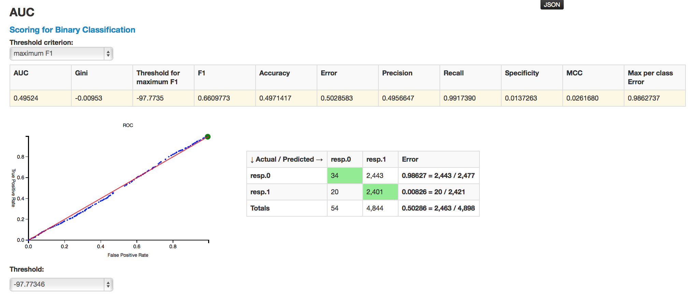

---
 
<H3><a href="http://localhost:54321/2/HitRatio.html" target="_blank">HitRatio</a></H3> 

####Enter the data frame key and select the column with actual results, then enter the data frame key for the predicted data. Optionally enter the maximum number of labels or a random number seed. 

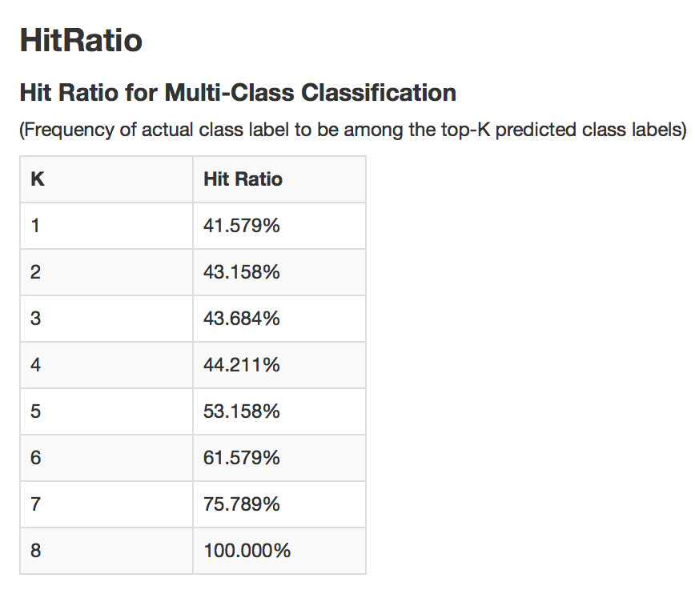

---

<H3><a href="http://localhost:54321/2/PCAScore.html" target="_blank">PCAScore</a></H3> 

####Determine how accurate your feature selection is for a particular model.


---

<H3><a href="http://localhost:54321/2/GainsLiftTable.html" target="_blank">Gains/Lift Table</a></H3> 

####Determine the accuracy of a model. 

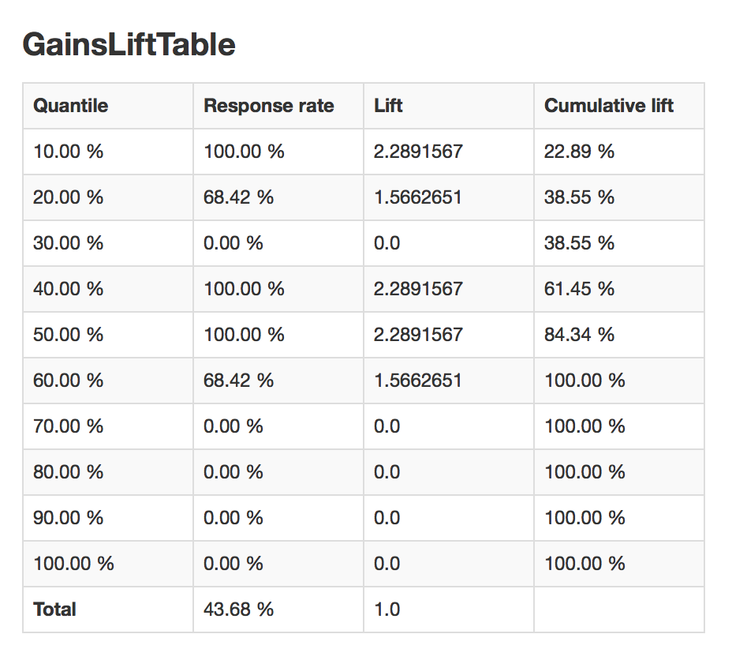

---

<H3><a href="http://localhost:54321/steam/index.html" target="_blank">Multi-model Scoring (Beta)</a></H3> 

####Compare and contrast multiple models on a data set to find the best performer to deploy into production. Refer to http://docs.0xdata.com/tutorial/steam.html for more information. 


---

##Optional next steps:
---


##From the Data menu:	
<H3><a href="http://localhost:54321/2/ExportFiles.html" target="_blank">Export Files</a></H3> 

####Enter a source key and location.

##From the Admin menu:
<H3><a href="http://localhost:54321/Shutdown.html" target="_blank">Shutdown</a></H3> 

####Shut down the H2O instance. 

---

## Troubleshooting using the Admin Menu
---

<H3><a href="http://localhost:54321/Jobs.html" target="_blank">Jobs</a></H3> 

####View information (such as destination key) for current jobs. 


---

<H3><a href="http://localhost:54321/Cloud.html" target="_blank">Cluster Status</a></H3> 

####View a summary of details about the nodes in the cluster.

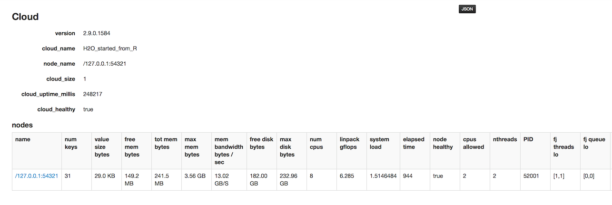
 
---

<H3><a href="http://localhost:54321/WaterMeterPerfbar.html" target="_blank">Water Meter (Perfbar)</a></H3> 

####View a real-time graphical performance monitor (for idle time, user time, and system time) of all the nodes in the cluster. 

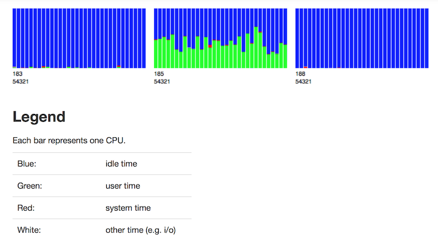

---


<H3><a href="http://localhost:54321/LogView.html" target="_blank">Inspect Log</a></H3> 

####View a log of activities for debugging. 

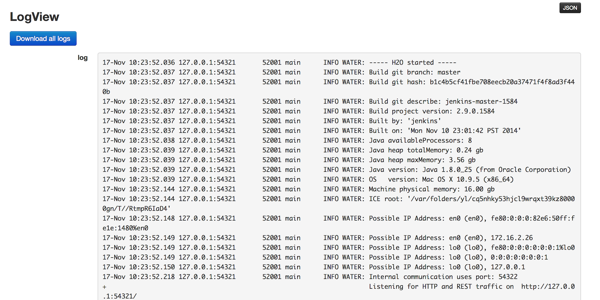

---

<H3><a href="http://localhost:54321/2/JProfile.html" target="_blank">Profiler</a></H3> 

####View profile dumps from all nodes. 


---

<H3><a href="http://localhost:54321/JStack.html" target="_blank">Stack Dump</a></H3> 

####View current memory usage statistics for debugging.

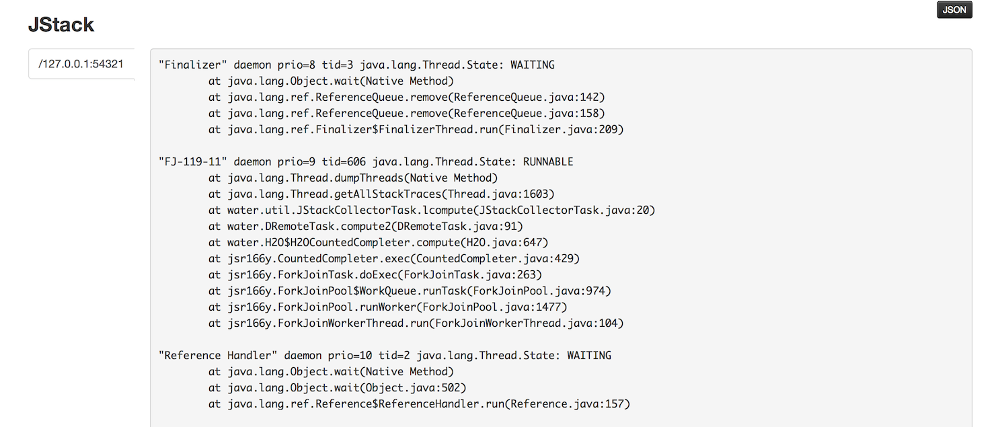

--- 

<H3><a href="http://localhost:54321/2/NetworkTest.html" target="_blank">Network Test</a></H3> 

####View network statistics. 


---

<H3><a href="http://localhost:54321/IOStatus.html" target="_blank">Cluster I/O</a></H3> 


####View the TCP transmit rate for all nodes in the cluster. 

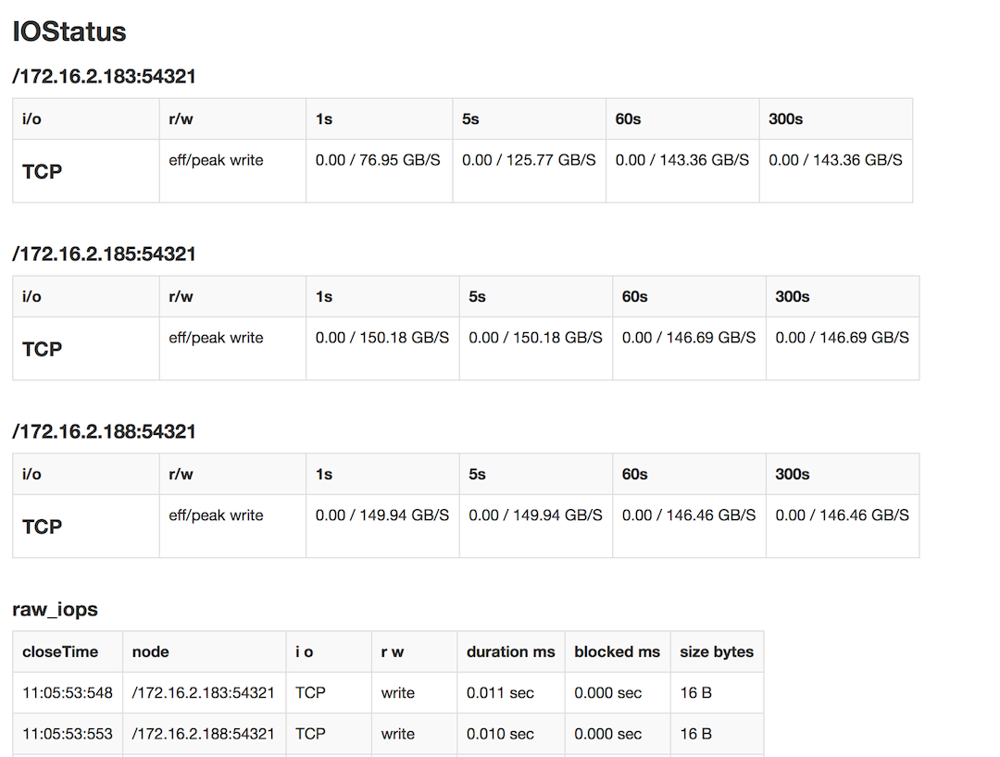

---

<H3><a href="http://localhost:54321/Timeline.html" target="_blank">Timeline</a></H3> 

####View a chronological list of events for all nodes in the cluster. 


---

<H3><a href="http://localhost:54321/2/UDPDropTest.html" target="_blank">UDP Drop Test</a></H3> 

####Check for dropped UDP packets.

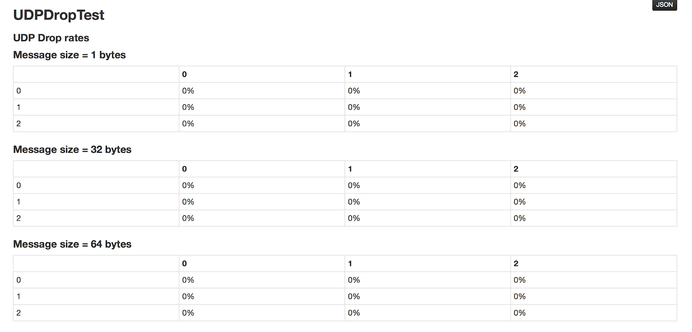

---

<H3><a href="http://localhost:54321/2/TaskStatus.html" target="_blank">Task Status</a></H3> 

####View a list of current tasks. 

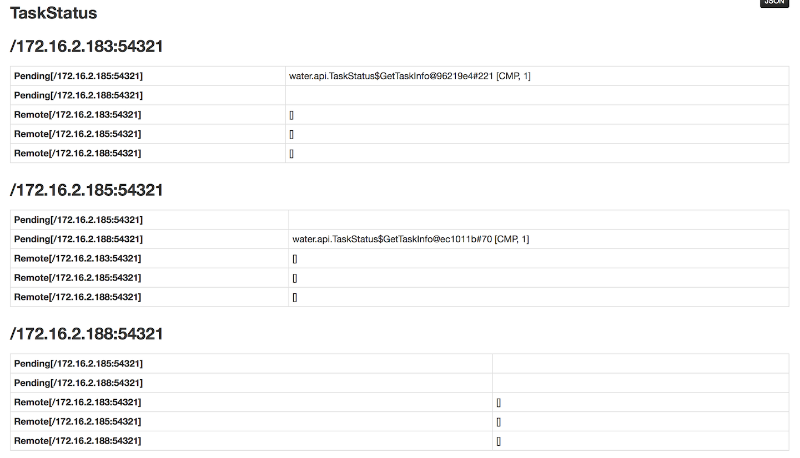

---


##POJO


####- Code in any front-end API and export the model as a POJO (Plain Old Java Object). 
####- Use models outside of H2O, either as a standalone or integrate it into a platform (like Hadoop's Storm). 
####- To view the Java code, wait until the model is finished generating and click the **Java model** button in the upper-right corner of the page. 


####The following is an excerpt of the Java code that is generated when you click the **Java model** button. 

	import java.util.Map;
	import water.genmodel.GenUtils.*;

	// AUTOGENERATED BY H2O at Wed Nov 12 16:13:53 PST 2014
	// H2O v2.8.1.1 (rel-markov - 1fb05e822617f493a5412ae037a59e37a66cce74)
	//
	// Standalone prediction code with sample test data for GBMModel named 	GBM_800a5e8478da29d34c10d4cbb1164c6f
	//
	// How to download, compile and execute:
	//     mkdir tmpdir
	//     cd tmpdir
	//     curl http://172.00.0.123:54321/h2o-model.jar > h2o-model.jar
	//     curl http://172.00.0.123:54321/2/GBMModelView.java?	_modelKey=GBM_800a5e8478da29d34c10d4cbb1164c6f > GBM_800a5e8478da29d34c10d4cbb1164c6f.java
	//     javac -cp h2o-model.jar -J-Xmx2g -J-XX:MaxPermSize=128m GBM_800a5e8478da29d34c10d4cbb1164c6f.java
	//
	//     (Note:  Try java argument -XX:+PrintCompilation to show runtime JIT compiler behavior.)

	public class GBM_800a5e8478da29d34c10d4cbb1164c6f extends water.genmodel.GeneratedModel {// Number of trees in this model.
	public static final int NTREES = 50;
	// Number of internal trees in this model (= NTREES*NCLASSES).
	public static final int NTREES_INTERNAL = 50;
	
	
####You can also export JSON code by clicking the **JSON** button. 

```
{"Request2":0,"response_info":{"h2o":"H2O_35170","node":"/172.00.0.123:54321","time":0,"status":"done","redirect_url":null},"gbm_model":{"_key":"GBM_800a5e8478da29d34c10d4cbb1164c6f","_dataKey":"australia.hex","_names":["salmax","minairtemp","maxairtemp","maxsst","maxsoilmoist","Max_czcs","runoffnew","premax"],"_domains":[null,null,null,null,null,null,null,null],"_priorClassDist":null,"_modelClassDist":null,"warnings":[],"N":50,"errs":[13457.830546736242,11160.87044022259,9299.920330083465,7791.546005626124,6569.275080242005,5589.753149908853,4725.479808514515,3990.895470371878,3428.9165487465157,2895.3669318789653,2490.1233931094503,2165.449831653928,1886.2214978469083,1636.4044061190564,1420.8784178697256,1243.7230298219777,1083.37297544572,958.5088177997428,847.3403939839853,"NaN","NaN","NaN","NaN","NaN","NaN","NaN","NaN","NaN","NaN","NaN","NaN","NaN","NaN","NaN","NaN","NaN","NaN","NaN","NaN","NaN",173.9486325877724,"NaN","NaN","NaN","NaN","NaN","NaN","NaN","NaN","NaN",121.44355029288486],"treeKeys":[["$02$__Tree__8e032d1c255c0b94ce23d8f6ff074558"],["$02$__Tree__b133fcbd62bd38759c625
```
---

