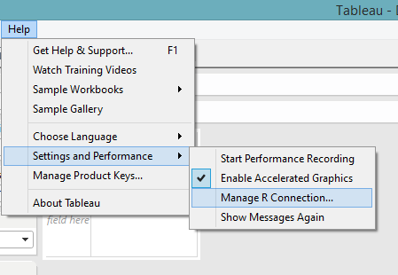
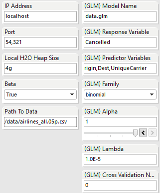
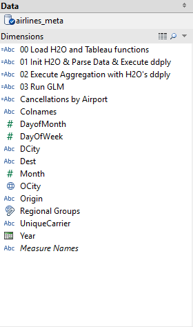
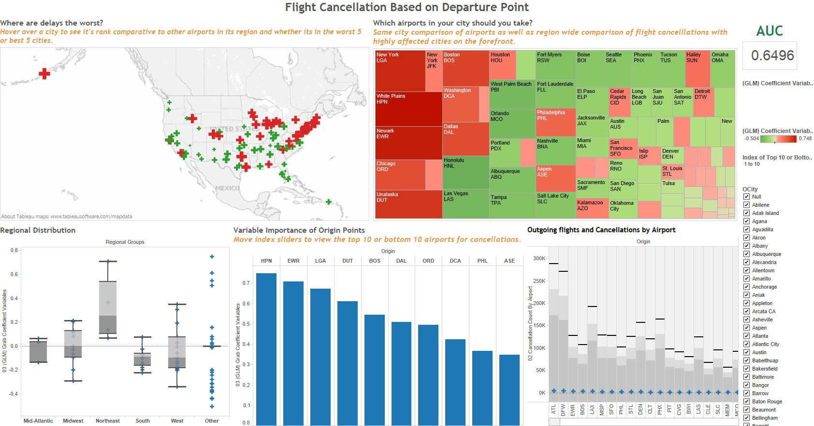
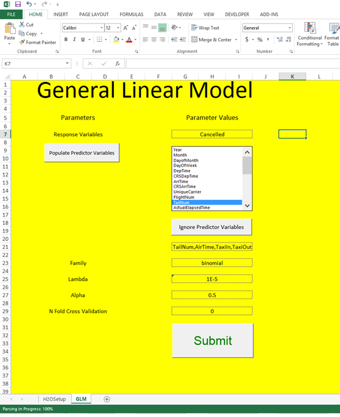

# Excel and Tableau - Beauty and Big Data

## Tableau

Download [Tableau](http://www.tableausoftware.com/) in order to use notebooks available on our [github](https://github.com/0xdata/h2o/tree/master/tableau).

### How does Tableau play with H2O?

Tableau is the frontend visual organizer that utilizes all the available statistic tools from open source R and H2O. Tableau will connect to R via a socket server using a library package already built for R. The H2O client package available for installation allows R to connect and communicate to H2O via a REST API. So by connecting Tableau to R, Tableau essentially can launch or initiate H2O and run any of the features already available for R.


### R Component

First, make sure to [install H<sub>2</sub>O](http://docs.0xdata.com/Ruser/Rinstall.html#r-installation) in R:

```
> install.packages("h2o")
```

Then install the Rserve package in R that will allow the user to start up a R session on a local server that Tableau will communicate with:

```
> install.packages("Rserve")
> library("Rserve")
> run.Rserve(port = 6311)
```

### Tableau Front End

  * **Step 1: Connection Setup**
  
	Open Demo_Template_8.1.twb which should have all the calculated fields containing R script already in the sidebar.

	Navigate to “Help > Settings and Performance > Manage R Connection” to establish a connection to the R serve.
	
	
	  
	Input for IP: 'localhost' and for port: '54321'

	

  * **Step 2: Data Connection**
  	
	Set the workbook’s connection to the airlines_meta.csv data by navigating to the data section on the left sidebar, right clicking on the airlines_meta and choosing to “Edit Connection.”

	

	
	

  * **Step 3: H2O Initialization**

	Configure the IP Address and Port that H2O will launch at as well as the path to the full airlines data file.

	
 
  * **Step 4: Data Import**

	
	
	Execute “00 Load H2O and Tableau functions” to run:

	```
	> library(h2o)
	> tableauFunctions <- functions(x){
	> ...
	> }
	> print('Finish loading necessary functions')
	```

	Execute “01 Init H2O & Parse Data” to:

	```
	> library(h2o)
	> localH2O = h2o.init(ip = "localhost", port = 54321, nthreads = -1)
	> data = h2o.importFile(localH2O, "/data/h2o-training/airlines/allyears2k.csv")
	```

	Execute “02 Compute Aggregation with H2O’s ddply” to groupby columns and do roll ups. First calculate the number of flights coming and going per month:
	```
	numFlights = ddply(data.hex, 'Month', nrow)
	numFlights.R = as.data.frame(numFlights)
	```
	
	Then compute the number of cancelled flights per month:

	```
	fun2 = function(df) {sum(df$Cancelled)}
	h2o.addFunction(h2oLocal, fun2)
	canFlights = ddply(data.hex, 'Month', fun2)
	canFlights.R = as.data.frame(canFlights)
	```
	
	Execute “03 Run GLM” to build a GLM model in H2O and grab back coefficient values that will be plotted in multiple worksheets:

	```
	data.glm = h2o.glm(x = c('Origin', 'Dest', 'Distance', 'Unique Carrier') , y = 'Cancelled', data = data.hex, family = 'binomial', nfolds = 0, standardize=TRUE)
	```

  * After the calculated fields finishes running, scroll through the different dashboards to see data differently.

		

## Using Excel with H<sub>2</sub>O

When working with excel the HTTP call to H2O will elicit a response in XML format that Microsoft excel can parse in both 32-bit and 64-bit version. For excel users that are already familiar with excel features and functions, this tutorial will work you through some basic H2O capabilities written in VBA. So the the demonstration excel file has to be macro enabled to access all the point and click features.

### Initialization and Data Import


  * Start up a H2O session
  * Input for *IP Address*: 'localhost'
  * Input for *Port*: '54321'
  * Input for *Heap Size*: '1g'
  * Input for *Number of Nodes*: '1'
  * Input for *File Path*: '/data/h2o-training/airlines/allyears2k.csv'
  * Hit Submit to import the data with a progress bar in the lower left hand corner 
  * The entry “H2O Data Hex Key” should automatically fill in with the destination key of the hex file now sitting in H2O

### Data Summary

  * Hit *Generate Summary* to create a new worksheet with a summary of all the columns in the data set
  * All columns except “NA%” are taken directly from H2O’s inspect page 


### Build GLM Model



  * Input for *Response Variable*: 'IsDepDelayed'
  * Then hit “Populate Predictor Variables,” which will eliminate the response variable from the Predictor Variables as well as highlight the variables with high NA counts to ignore.
  * Input for **family**: 'binomial'
  * Fill in other information such as lambda, alpha, and the number of cross validation you want to run. 
  * Hit submit to start the model build

### Visualize Model Output
  * On the *Output Models* section, select a model you'll like to visualize
  * Hit *Show Output* to show the coefficients for the GLM model.
  * Create a bar chart and sort the coefficients by magnitude.

